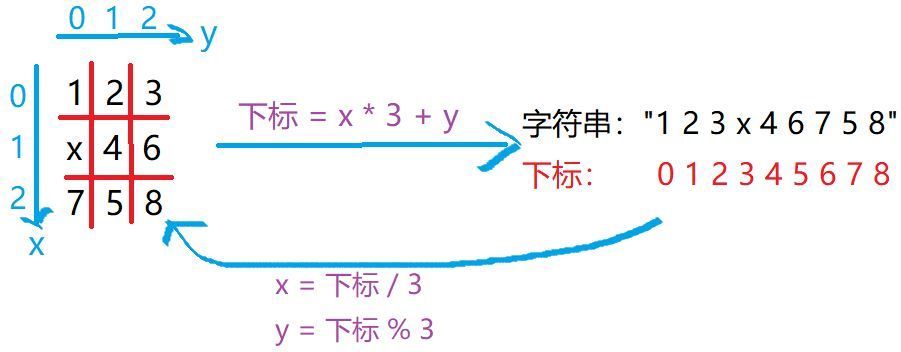
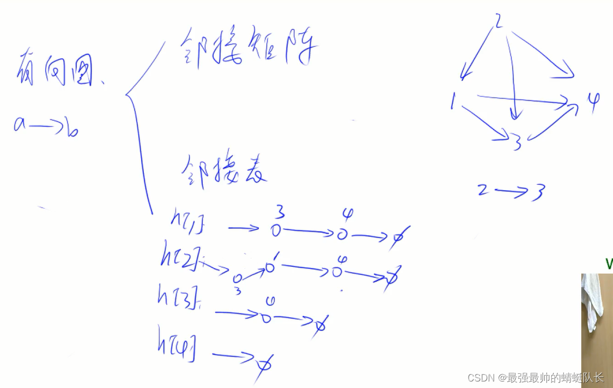
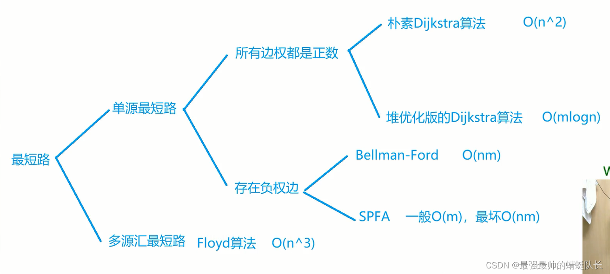
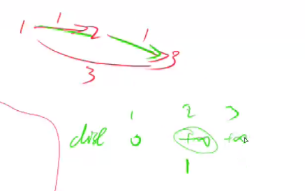
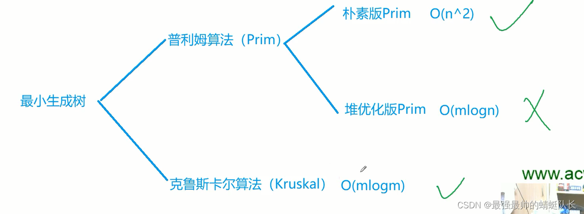

[TOC]

------

# 基础图论与搜索

## DFS与BFS

### DFS深度优先遍历

DFS是一个非常执着的人，不管往哪条路走，都一定会走到头，走到头才会回溯，但不是回到起点，而是每退一步都会看一看还有没有其他路，有则继续向下走。

从数据结构上来看，DFS 其实是 栈（stack）
从使用空间上来看，DFS往下搜索，只需要记录向下搜索的一条路径就可以了，所以使用空间为 O(n)。

优势：DFS空间上更占优势，但DFS 不具有最短路性质。


DFS里有两个重要的概念：**回溯和剪枝**。

最重要的是考虑顺序，DFS俗称暴力搜索，可以画一个树，方便理解。

**排列数字（全排列）**

[AcWing 842. 排列数字--深度优先遍历代码+注释 - AcWing](https://www.acwing.com/solution/content/30988/)

回退的这个过程就叫回溯，回溯时一定要恢复现场。
如果在搜索时，发现这个分支有冲突了，就可以直接停止搜索，可以看成把这个过程给，这就是剪枝。

算法：

- 用 path 数组保存排列，当排列的长度为 n 时，是一种方案，输出。
- 用 state 数组表示数字是否用过。当 state[i] 为 1 时：i 已经被用过，state[i] 为 0 时，i 没有被用过。
- dfs(i) 表示的含义是：在 path[i] 处填写数字，然后递归的在下一个位置填写数字。
- 回溯：第 i 个位置填写某个数字的所有情况都遍历后， 第 i 个位置填写下一个数字。

代码:

```cpp
#include<iostream>
using namespace std;
const int N = 10;
int path[N];//保存序列
int state[N];//数字是否被用过
int n;
void dfs(int u)
{
    if(u > n)//数字填完了，输出
    {
        for(int i = 1; i <= n; i++)//输出方案
            cout << path[i] << " ";
        cout << endl;
    }

    for(int i = 1; i <= n; i++)//空位上可以选择的数字为:1 ~ n
    {
        if(!state[i])//如果数字 i 没有被用过
        {
            path[u] = i;//放入空位
            state[i] = 1;//数字被用，修改状态
            dfs(u + 1);//填下一个位
            state[i] = 0;//回溯，取出 i
        }
    }
}

int main()
{

    cin >> n;
    dfs(1);
}
```

**n皇后**	[AcWing 843. n-皇后问题--图解+代码注释 - AcWing](https://www.acwing.com/solution/content/30231/)

n−皇后问题是指将 n 个皇后放在 n×n 的国际象棋棋盘上，使得皇后不能相互攻击到，即任意两个皇后都不能处于同一行、同一列或同一斜线上。

要注意剪枝，数组长度为n，每个值为在当前第 i 行，皇后的位置，如果已经有两个皇后有冲突，那么可以直接结束搜索，就是剪枝。
我们抽象出来了题目，每一行只有一个皇后，所以可以枚举每一行的皇后，但如果更原始一点，不知道这个，只能判断当前格子放不放皇后。

深度优先遍历dfs。

每一行必定有一个皇后，对行进行深度遍历。
对于第 r 行的第 i 个位置，判断每个点是否可以放皇后，如果可以，则放皇后，然后处理 r + 1 行。
直到 r = n，程序指行完毕。

核心思路：深度优先遍历

- 函数名：void dfs(int r): 深度优先遍历函数。参数r：从第r行开始放棋子，处理第r行。

- 递归结束判定：见代码，当 r == n的时候，说明应该处理第 n行了，也代表第 0~n-1行放好棋子，也就是整个棋盘放好了棋子，也就是得到了一种解，也就是递归结束。

- 第r行，第i列能不能放棋子：用数组dg udg cor 分别表示：点对应的两个斜线以及列上是否有皇后。
  dg[i + r] 表示 r行i列处，所在的对角线上有没有棋子，udg[n - i + r]表示 r行i列处，所在的反对角线上有没有棋子，cor[i]表示第i列上有没有棋子。如果 r行i列的对角线，反对角线上都没有棋子，即!cor[i] && !dg[i + r] && !udg[n - i + r]为真，则代表 r行i列处可以放棋子。

```cpp
#include <iostream>
using namespace std;

const int N = 11;

char q[N][N];//存储棋盘
bool dg[N * 2], udg[N * 2], cor[N];//点对应的两个斜线以及列上是否有皇后

int n;

void dfs(int r)
{
    if(r == n)//放满了棋盘，输出棋盘
    {
        for(int i = 0; i < n; i++)
        {
            for(int j = 0; j < n; j++)
                cout << q[i][j];
            cout << endl;
        }
        cout << endl;
        return;
    }

    for(int i = 0; i < n; i++)//第 r 行，第 i 列 是否放皇后
    {
        if(!cor[i] && !dg[i + r] && !udg[n - i + r])//不冲突，放皇后
        {
            q[r][i] = 'Q';
            cor[i] = dg[i + r] = udg[n - i + r] = 1;//对应的 列， 斜线 状态改变
            dfs(r + 1);//处理下一行
            cor[i] = dg[i + r] = udg[n - i + r] = 0;//恢复现场
            q[r][i] = '.';
        }
    }
}

int main()
{
    cin >> n;
    for (int i = 0; i < n; i ++ )
        for (int j = 0; j < n; j ++ )
            q[i][j] = '.';
    dfs(0);
    return 0;
}
```

### BFS宽度优先遍历

BFS像一个稳重的人，他每一次都只会扩展一层，只有这一层全部扩展完之后，才会扩展下一层。

从数据结构上来看，BFS 其实是 队列（queue）
从使用空间上来看，BFS每次会搜索一层，所以空间复杂度为指数级，使用空间为 O(n)。

优势：因为 BFS 每次是一层一层往外扩展，所以每次搜索一定是最近的点，所以适合求最短路，但空间上不占优势。

凡是：最小步数、最短距离、最少操作次数，基本都是BFS

DP问题 和 最短路问题是互通的，DP问题是包含最短路问题。
DP问题是没有环的最短路。
不是所有的最短路问题都可以拿最短路来做，只有当所有边的权重都为1的时候才能用BFS，否则都用最短路算法。
DP问题不能用最短路算法，因为其时间复杂度高。
广搜时，使用队列记录当前扩展的点，下次再根据队列中的元素，继续向外扩展。
**例题：**

走迷宫	[AcWing 844. 走迷宫 - AcWing](https://www.acwing.com/activity/content/problem/content/907/)

给定一个 n×m 的二维整数数组，用来表示一个迷宫，数组中只包含 0 或 1，其中 0 表示可以走的路，1 表示不可通过的墙壁。
最初，有一个人位于左上角 (1,1) 处，已知该人每次可以向上、下、左、右任意一个方向移动一个位置。
请问，该人从左上角移动至右下角 (n,m) 处，至少需要移动多少次。
数据保证 (1,1) 处和 (n,m) 处的数字为 0，且一定至少存在一条通路。

思路：从起点开始，往前走第一步，记录下所有第一步能走到的点，然后从所第一步能走到的点开始，往前走第二步，记录下所有第二步能走到的点，重复下去，直到走到终点。输出步数即可。

优化：将除了图以外的地方用memset设为不能走的边界1，可以缩减代码量

```cpp
#include<iostream>
#include <algorithm>
#include <cstring>
#include <queue>
using namespace std;
const int N=110;
int mp[N][N];//迷宫地图 
bool st[N][N];//表示该坐标是否已被经过 
int num[N][N];//存储的就是从起点到坐标对应的最短路径 (搜索距离)
typedef pair<int,int> pii;
//pair用法，存二维数据(坐标) 
//缩写为pii 
int n,m;
const int dx[]={-1,1,0,0},dy[]={0,0,-1,1};
void bfs(){
    queue<pii>q;
//  priority_queue<pii>q;//优先队列
    q.push({1,1});
    while(q.size()){
        pii t=q.front();
        int x=t.first,y=t.second;
        q.pop();
        for(int i=0;i<4;i++){//(i<4是为了遍历四个方向) 
            int xx=x+dx[i],yy=y+dy[i];

            if(xx<1||xx>n||yy<1||yy>m)continue;//撞四周墙 
            if(mp[xx][yy]==1)continue; // 撞1墙 
            if(st[xx][yy]==1)continue;//吃回头草 
            //三种情况代表三次撞墙越界
            //判断完后此路可通

            st[xx][yy]=1;//标记走过，此路不投，老马不吃回头草哈哈
            num[xx][yy]=num[x][y]+1;
            q.push({xx,yy}); ////将该坐标放入队列中 
        } 
    } 
    cout<<num[n][m]<<endl;
}
int main(){
    cin>>n>>m;
    for(int i=1;i<=n;i++){
        for(int j=1;j<=m;j++){
            cin>>mp[i][j];
            //读入地图 
        }
    }
    bfs();
    return 0;
}
```

八数码：	[AcWing 845. 八数码 - AcWing](https://www.acwing.com/activity/content/problem/content/908/)

题目描述
在一个3×3的网格中，1~8这8个数字和一个“x”恰好不重不漏地分布在这3×3的网格中。现在，给你一个初始网格，请你求出得到正确排列至少需要进行多少次交换。如果不存在解决方案，则输出”-1”。

例如：

```
1 2 3
x 4 6
7 5 8
```

在游戏过程中，可以把“x”与其上、下、左、右四个方向之一的数字交换（如果存在）。
我们的目的是通过交换，使得网格变为如下排列（称为正确排列）：

```
1 2 3
4 5 6
7 8 x
```

思路：

```
队列可以用 queue<string>
//直接存转化后的字符串
dist数组用 unordered_map<string, int>
//将字符串和数字联系在一起，字符串表示状态，数字表示距离
```




```cpp
#include <iostream>
#include <algorithm>
#include <queue>
#include <unordered_map>
using namespace std;
int bfs(string start)
{
    //定义目标状态
    string end = "12345678x";
    //定义队列和dist数组
    queue<string> q;
    unordered_map<string, int> d;
    //初始化队列和dist数组
    q.push(start);
    d[start] = 0;
    //转移方式
    int dx[4] = {1, -1, 0, 0}, dy[4] = {0, 0, 1, -1};

    while(q.size())
    {
        auto t = q.front();
        q.pop();
        //记录当前状态的距离，如果是最终状态则返回距离
        int distance = d[t];
        if(t == end) return distance;
        //查询x在字符串中的下标，然后转换为在矩阵中的坐标
        int k = t.find('x');
        int x = k / 3, y = k % 3;

        for(int i = 0; i < 4; i++)
        {
            //求转移后x的坐标
            int a = x + dx[i], b = y + dy[i];
            //当前坐标没有越界
            if(a >= 0 && a < 3 && b >= 0 && b < 3)
            {
                //转移x
                swap(t[k], t[a * 3 + b]);
                //如果当前状态是第一次遍历，记录距离，入队
                if(!d.count(t))
                {
                    d[t] = distance + 1;
                    q.push(t);
                }
                //还原状态，为下一种转换情况做准备
                swap(t[k], t[a * 3 + b]);
            }
        }
    }
    //无法转换到目标状态，返回-1
    return -1;
}

int main()
{
    string c, start;
    //输入起始状态
    for(int i = 0; i < 9; i++)
    {
        cin >> c;
        start += c;
    }

    cout << bfs(start) << endl;

    return 0;
}
```


### 二者区别

都可以对整个搜索空间进行遍历。
搜索的时候都是像一棵树一样搜索。

但是搜索的顺序不一样：
DFS 优先深度，到不能再前进的时候（叶子节点）再回溯。
BFS 一层层搜索，搜索完每一代节点后，再搜索下一代节点。

|          | DFS   | BFS    |
| :------- | ----- | ------ |
| 数据结构 | stack | queue  |
| 空间     | O(h)  | O(2^h) |


DFS 在空间使用上有优势，但不具有最短路性。
BFS 有一个最短路的概念，即假设树中每条边的权重均为1， BFS 搜索到某一个点的路径，一定是最短距离。

最小步数、最短距离，最少操作等：BFS
算法思路较奇怪或者空间要求较高：DFS

## 树与图的存储

树是一种特殊的图。树是一种无环联通图。

图分为：有向图、无向图。
对于无向图中的边ab，存储两条有向边a->b, b->a。
因此我们可以只考虑有向图的存储。

有向图的存储：

```text
1、邻接矩阵，g[a][b] = a->b 空间：n^2
2、邻接表（用的多）。使用单链表，存储每个点能够到达的位置，次序是无所谓的。
```



代码：

```cpp
// 对于每个点k，开一个单链表，存储k所有可以走到的点。h[k]存储这个单链表的头结点
int h[N], e[N], ne[N], idx;

// 添加一条边a->b
void add(int a, int b)
{
    e[idx] = b, ne[idx] = h[a], h[a] = idx ++ ;
}

// 初始化
idx = 0;
memset(h, -1, sizeof h); //重点，默认添加

//存储
add(a,b);
```

无向图的存储:

```cpp
add(a,b),add(b,a);
```

## 树与图的遍历

深搜是一条路走到黑，广搜是一层层的走

时间复杂度 O(n+m), n 表示点数，m 表示边数

**深度优先遍历**

[846. 树的重心 - AcWing题库](https://www.acwing.com/problem/content/848/)

注：无向边要开双向链表add(a,b),add(b,a)

对应的const int N也要增大一倍

```cpp
int n;
int h[N],e[N],ne[N],idx;//e[N*2],ne[N*2]切记，谁也不想debug半个小时
bool st[N];
int dfs(int u)
{
    st[u] = true; // st[u] 表示点u已经被遍历过
    for (int i = h[u]; i != -1; i = ne[i])
    {
        int j = e[i];
        if (!st[j]) dfs(j);
    }
}
```

**宽度优先遍历**

[847. 图中点的层次 - AcWing题库](https://www.acwing.com/problem/content/849/)


```cpp
queue<int> q;
st[1] = true; // 表示1号点已经被遍历过
q.push(1);

while (q.size())
{
    int t = q.front();
    q.pop();

    for (int i = h[t]; i != -1; i = ne[i])
    {
        int j = e[i];
        if (!st[j])
        {
            st[j] = true; // 表示点j已经被遍历过
            q.push(j);
        }
    }
}

```

## 拓扑排序

[AcWing 848. $\color{green}{拓扑排序--思路介绍+图解模拟+详细代码注释 }$ - AcWing](https://www.acwing.com/solution/content/103954/)

啥是拓扑排序?（即为不是环）

- 一个有向图，如果图中有入度为 0 的点，就把这个点删掉，同时也删掉这个点所连的边。

- 一直进行上面出处理，如果所有点都能被删掉，则这个图可以进行拓扑排序。

图的广搜的经典应用：求拓扑序

有向无环图又被称为拓扑图

```cpp
const int N = 100010;
int h[N], e[N], ne[N], idx;//邻接表存储图
int q[N];//队列保存入度为0的点，也就是能够输出的点，
int n, m;//保存图的点数和边数
int d[N];////保存各个点的入度
bool topsort()
{
    int hh = 0, tt = -1; //模拟队列可以用deque代替
    for (int i = 1; i <= n; i ++ ){//遍历一遍顶点的入度。
        if (!d[i]){//如果入度为 0, 则可以入队列
            q[ ++ tt] = i;
    	}
	}
    while (hh <= tt) //循环处理队列中点的
    {
        int t = q[hh ++ ];
        for (int i = h[t]; i != -1; i = ne[i])
        { //循环删除 a 发出的边
            int b = e[i]; //a 有一条边指向b
            if (-- d[b] == 0){
                //删除边后，b的入度减1
                //如果b的入度减为 0,则 b 可以输出，入队列
                q[ ++ tt] = b;
            }
        }
    }

    // 如果所有点都入队了，说明存在拓扑序列；否则不存在拓扑序列。
    return tt == n - 1;//如果队列中的点的个数与图中点的个数相同，则可以进行拓扑排序
}
	q[N]//队列中保存了所有入度为0的点
```

## 最短路径算法



不会考察证明算法的正确性，而要考察建图，如何把原问题抽象成一个最短路问题，如何定义点和边。这个过程是最难的。
前面很多问题，或者后面的数学问题，侧重于原理，侧重于证明。最短路算法，侧重于抽象，侧重于实现。

### 朴素dijkstra算法

[AcWing 849. Dijkstra求最短路 I：图解 详细代码（图解） - AcWing](https://www.acwing.com/solution/content/38318/)

时间复杂是 O(n^2+m)， n 表示点数，m 表示边数。
适合边很多的**稠密图**。

**步骤：**

1. 第一个点到起点为0，其他点到起点为正无穷（一个很大的数即可）
2. 遍历，每次确定一个点到起点的最短路

```cpp
int g[N][N]; //存储每条边 
int dist[N]; //存储1号点到每个点的最短距离 
bool st[N];  //存储每个点的最短路是否已经确定
int n,m;
int dijkstra(){
    memset(dist,0x3f,sizeof dist);
    dist[1]=0;
    for(int i=0;i<n-1;i++){
    //最后一个节点不需要确定 ，因为前面操作已经涉及 
        int t=-1; // 在还未确定最短路的点中，寻找距离最小的点
        for(int j=1;j<=n;j++){
            if(!st[j]&&(t==-1||dist[t]>dist[j])){
                //该步骤即寻找还未确定最短路的点中路径最短的点
                t=j;
            }
        }
        for(int j=1;j<=n;j++){
            dist[j]=min(dist[j],dist[t]+g[t][j]);
            //更新所有点 ，dist[t]+g[t][j]意思为1-t距离加上t-j距离 
        }
        st[t]=true;
    }
    if(dist[n]==0x3f3f3f3f) return -1;
    return dist[n];
}

int main(){
    memset(g,0x3f,sizeof g);
    while(check()){
        g[x][y]=min(g[x][y],z); //如果发生重边的情况则保留最短的一条边
    }
}
```


### 堆优化版dijkstra

[AcWing 850. Dijkstra求最短路 II：详解+代码注释 - AcWing](https://www.acwing.com/solution/content/38323/)

时间复杂度 O(mlogn)，n 表示点数，m 表示边数。

如果是一个稀疏图，有10w个点，朴素dijkstra 肯定会超时，

这里面用时最多的是找距离最近的点，也就是求最小值，那么可以用小根堆。

```cpp
int n,m;
int h[N],w[N],ne[N],e[N],idx;
int dist[N];
bool st[N];
// h[i] 表示头结点的下标
// e[i] 表示边能到那个点
// w[i] 表示边长 
// ne[i] 表示节点i的next指针是多少
// idx 存储当前已经用到了哪个点
void add(int a,int b,int c){
    e[idx]=b;
    w[idx]=c;
    ne[idx]=h[a];
    h[a]=idx++;
}
int dijkstra(){
    memset(dist,0x3f,sizeof dist);
    dist[1]=0;
    priority_queue<PII,vector<PII>,greater<PII>> heap;
    heap.push({0,1}); // first存储距离，second存储节点编号
    while(!heap.empty()){
        auto t=heap.top();
        heap.pop();
        int ver=t.second,distance=t.first;
        if(st[ver]) continue;
        st[ver]=true;
        for(int i=h[ver];i!=-1;i=ne[i]){
            int j=e[i];
            if(dist[j]>dist[ver]+w[i]){
                dist[j]=dist[ver]+w[i];
                heap.push({dist[j],j});
            }
        }

    }
    if(dist[n]==0x3f3f3f3f) return -1;
    return dist[n];
} 
int main(){
	memset(h,-1,sizeof h);
}
```


### Bellman-Ford算法

[AcWing 853. 有边数限制的最短路 - AcWing](https://www.acwing.com/solution/content/6320/)

（基于离散数学的一些知识）

时间复杂度 O(nm), n 表示点数，m 表示边数。

```cpp
int n, m;       // n表示点数，m表示边数
int dist[N];        // dist[x]存储1到x的最短路距离
int last[N];       //备份数组防止串联
struct Edge     // 边，a表示出点，b表示入点，w表示边的权重
{
    int a, b, w;
}edges[M];

// 求1到n的最短路距离，如果无法从1走到n，则返回-1。
int bellman_ford()
{
    memset(dist, 0x3f, sizeof dist);
    dist[1] = 0;

    for (int i = 0; i < n; i ++ )//k次循环
    {
        memcpy(back, dist, sizeof dist);
        for (int j = 0; j < m; j ++ )//遍历所有边
        {
            int a = edges[j].a, b = edges[j].b, w = edges[j].w;
//          if (dist[b] > dist[a] + w)
//              dist[b] = dist[a] + w;
            dist[b] = min(dist[b], back[a] + w);
            //使用backup:避免给a更新后立马更新b, 这样b一次性最短路径就多了两条边出来
        }
    }

    if (dist[n] > 0x3f3f3f3f / 2) return -1;
    return dist[n];
}

```

**为什么需要back[a]数组**
为了避免如下的串联情况， 在边数限制为一条的情况下，节点3的距离应该是3，但是由于串联情况，利用本轮更新的节点2更新了节点3的距离，所以现在节点3的距离是2。


正确做法是 用上轮节点2更新的距离--无穷大 ，来更新节点3， 再取最小值，所以节点3离起点的距离是3。



### SPFA 算法

[AcWing 851. spfa求最短路---图解--$ - AcWing](https://www.acwing.com/solution/content/105508/)

（队列优化的Bellman-Ford算法）

时间复杂度 平均情况下 O(m)，最坏情况下 O(nm), n 表示点数，m 表示边数。
先把起点放到队列中，之后把每一个变小的节点放到队列中，只要队列不空。

```cpp
int n;      // 总点数
int h[N], w[N], e[N], ne[N], idx;       // 邻接表存储所有边
int dist[N];        // 存储每个点到1号点的最短距离
bool st[N];     // 存储每个点是否在队列中

// 求1号点到n号点的最短路距离，如果从1号点无法走到n号点则返回-1
int spfa()
{
    memset(dist, 0x3f, sizeof dist);
    dist[1] = 0;

    queue<int> q;
    q.push(1);
    st[1] = true;

    while (q.size())
    {
        auto t = q.front();
        q.pop();

        st[t] = false;//从队列中取出来之后该节点st被标记为false,代表之后该节点如果发生更新可再次入队

        for (int i = h[t]; i != -1; i = ne[i])
        {
            int j = e[i];
            if (dist[j] > dist[t] + w[i])
            {
                dist[j] = dist[t] + w[i];
                if (!st[j])     // 如果队列中已存在j，则不需要将j重复插入
                {
                    q.push(j);
                    st[j] = true;
                }
            }
        }
    }

    if (dist[n] == 0x3f3f3f3f) return -1;
    return dist[n];
}
int main(){
    memset(h,-1,sizeof h);
}
```


### SPFA 判断图中是否存在负环

[AcWing 852. spfa判断负环 - AcWing](https://www.acwing.com/solution/content/6336/)

时间复杂度是 O(nm)，n 表示点数，m 表示边数

```cpp
int h[N],w[N],e[N],ne[N],idx;
int dist[N],cnt[N];//dis就是到某个点的最短距离（更新后的），cnt是来求到某个点的最短路径有几条边
bool st[N];
void add(int a,int b,int c){
    w[idx]=c;
    e[idx]=b;
    ne[idx]=h[a];
    h[a]=idx++;
}
bool spfa(){
    // 不需要初始化dist数组
    // 原理：如果某条最短路径上有n个点（除了自己），那么加上自己之后一共有n+1个点，由抽屉原理一定有两个点相同，所以存在环。
    queue<int> q;
    for(int i=1;i<=n;i++){//因为负权回路不一定是在从1开始的路径上，所以把所有点都放进队列，来更新距离
        q.push(i);//这里就相当于，建了个虚拟的边，一开始到每个点的距离都是0
        st[i]=true;//在下面的for循环中，当遇到负权回路，会因为遇见负数，不停地更新，导致无限循环下去，最终Yes
    }
    while(!q.empty()){
        auto t=q.front();
        q.pop();
        st[t]=false;
        for(int i=h[t];i!=-1;u=ne[i]){
            int j=e[i];
            if(dist[j]>dist[t]+w[i]){
                dist[j]=dist[t]+w[i];
                cnt[j]=cnt[t]+1; //每次更新距离就相当于，在原有的边上加了一条边
                if(cnt[j]>=n) return true; //如果没有回路，n个点至多只有n-1个边（最短路径情况下）
                if(!st[j]){
                    q.push(j);
                    st[j]=true;
                } 
            }
        }
    }
    return false;
}
int main(){
    memset(h,-1,sizeof h);
}
```


### floyd算法（基于动态规划）

[AcWing 854. Floyd求最短路 - AcWing](https://www.acwing.com/activity/content/problem/content/923/)

时间复杂度是 O(n^3)，n 表示点数

```cpp
const int N=210,INF=1e9;
int d[N][N];
// 算法结束后，d[a][b]表示a到b的最短距离
void floyd(){
    for(int k=1;k<=n;k++){
        for(int i=1;i<=n;i++){
            for(int j=1;j<=n;j++){
                d[i][j]=min(d[i][j],d[i][k]+d[k][j]);
            }
        }
    }
}
int main(){
    for (int i = 1; i <= n; i ++ )
        for (int j = 1; j <= n; j ++ )
            if (i == j) d[i][j] = 0;
            else d[i][j] = INF; //初始化
}
```


## 最小生成树



稠密图用 Prim，稀疏图用 Kruskal，堆优化Prim 不常用，它和 Kruskal 都是对应稀疏图，但 Kruskal 代码更清晰，更短。

### Prim算法

[AcWing 858. Prim算法求最小生成树：图解+详细代码注释（带上了保存路径） - AcWing](https://www.acwing.com/solution/content/38312/)

prim 算法干的事情是：给定一个无向图，在图中选择若干条边把图的所有节点连起来。要求边长之和最小。在图论中，叫做求最小生成树。每次将离连通部分的最近的点和点对应的边加入的连通部分，连通部分逐渐扩大，最后将整个图连通起来，并且边长之和最小.

```cpp
const int N=510,INF=0x3f3f3f3f;
int n,m;
int g[N][N];//存储图
int dist[N];//存储各个节点到生成树的距离
bool st[N];//节点是否被加入到生成树中
int prim(){
	memset(dist,0x3f,sizeof dist);
	dist[1]=0; //从 1 号节点开始生成 
	int res=0;
	for(int i=0;i<n;i++){ //每次循环选出一个点加入到生成树
		int t=-1;
		for(int j=1;j<=n;j++){ //每个节点一次判断
			if(!st[j]&&(t==-1||dist[j]<dist[t])){ //如果没有在树中，且到树的距离最短，则选择该点
				t=j;
			}
		}
		if(dist[t]==INF) return INF;
    `	//如果孤立点，直返输出不能，然后退出
        
		res+=dist[t];
		st[t]=true; //这个点已经被选中
		for(int j=1;j<=n;j++){ //更新生成树外的点到生成树的距离
			dist[j]=min(dist[j],g[t][j]);
		}
	}
	return res;
}
int main(){
    memset(g,0x3f,sizeof g);
    while(m--){
        int a,b,c;
        g[a][b]=g[b][a]=min(g[a][b],c);
    }
}
```


### Kruskal算法

[AcWing 859. Kruskal算法求最小生成树-- AcWing](https://www.acwing.com/solution/content/104383/)

算法思路：

- 将所有边按照权值的大小进行升序排序，然后从小到大一一判断。

- 如果这个边与之前选择的所有边不会组成回路，就选择这条边分；反之，舍去。

- 直到具有 n 个顶点的连通网筛选出来 n-1 条边为止。

- 筛选出来的边和所有的顶点构成此连通网的最小生成树。


判断是否会产生回路的方法为：使用并查集。

- 在初始状态下给各个个顶点在不同的集合中。

- 遍历过程的每条边，判断这两个顶点的是否在一个集合中。

- 如果边上的这两个顶点在一个集合中，说明两个顶点已经连通，这条边不要。如果不在一个集合中，则要这条边。

```cpp
int n, m;       // n是点数，m是边数
int p[N];       // 并查集的父节点数组

struct Edge     // 存储边
{
    int a, b, w;

    bool operator< (const Edge &W)const
    {
        return w < W.w;
    }
}edges[M];

int find(int x)     // 并查集核心操作
{
    if (p[x] != x) p[x] = find(p[x]);
    return p[x];
}

int kruskal()
{
    sort(edges, edges + m);

    for (int i = 1; i <= n; i ++ ) p[i] = i;    // 初始化并查集

    int res = 0, cnt = 0;
    for (int i = 0; i < m; i ++ )
    {
        int a = edges[i].a, b = edges[i].b, w = edges[i].w;

        a = find(a), b = find(b);
        if (a != b)     // 如果两个连通块不连通，则将这两个连通块合并
        {
            p[a] = b;
            res += w;
            cnt ++ ;
        }
    }

    if (cnt < n - 1) return INF;
    return res;
}

```


## 二分图


什么叫二分图

- 有两顶点集且图中每条边的的两个顶点分别位于两个顶点集中，每个顶点集中没有边直接相连接！

- 说人话的定义：图中点通过移动能分成左右两部分，左侧的点只和右侧的点相连，右侧的点只和左侧的点相连。

- 下图就是个二分图：


### 染色法判定二分图

[AcWing 860. 染色法判定二分图-- AcWing](https://www.acwing.com/solution/content/105874/)

给定一个 n 个点 m 条边的无向图，图中可能存在重边和自环。

请你判断这个图是否是二分图。

思路：

如果判断一个图是不是二分图？

- 开始对任意一未染色的顶点染色。

- 判断其相邻的顶点中，若未染色则将其染上和相邻顶点不同的颜色。

- 若已经染色且颜色和相邻顶点的颜色相同则说明不是二分图，若颜色不同则继续判断。

- bfs和dfs可以搞定！

```cpp
#include <bits/stdc++.h>
const int N = 100010 * 2;
int e[N], ne[N], idx;//邻接表存储图
int h[N];
int color[N];//保存各个点的颜色，0 未染色，1 是红色，2 是黑色
int n, m;//点和边
void add(int a, int b)//邻接表插入点和边
{
    e[idx] = b, ne[idx]= h[a], h[a] = idx++;
}
bool dfs(int u, int c)
{
    color[u] = c;//u的点成 c 染色
    
	//遍历和 u 相邻的点
    for (int i = h[u]; i != -1; i = ne[i])
    {
        int j = e[i];
        if (!color[j])//相邻的点没有颜色,则递归处理这个相邻点
        {
            if (!dfs(j, 3 - c)) return false;
        }
        else if (color[j] == c) return false;
        //如果已经染色，判断颜色是否为c
        //如果是，说明冲突，返回(起点和终点颜色不一样)
   		
    }
    return true;
}
int main()
{
    scanf("%d%d", &n, &m);
    memset(h, -1, sizeof h);
    while (m -- ){
        int a, b;
        scanf("%d%d", &a, &b);
        add(a, b), add(b, a);
    }
    bool flag = true;
    for (int i = 1; i <= n; i ++ )
        if (!color[i])
        {
            if (!dfs(i, 1))
            {
                flag = false;
                break;
            }
        }
    if (flag) puts("Yes");
    else puts("No");
    return 0;
}
```


### 匈牙利算法

[AcWing 861. 二分图的最大匹配 - AcWing](https://www.acwing.com/activity/content/code/content/4983413/)

给定一个二分图，其中左半部包含 n1 个点（编号 1∼n1），右半部包含 n2 个点（编号 1∼n2），二分图共包含 m 条边。

数据保证任意一条边的两个端点都不可能在同一部分中。

请你求出二分图的最大匹配数。

> 二分图的匹配：给定一个二分图 G，在 G 的一个子图 M 中，M 的边集 {E} 中的任意两条边都不依附于同一个顶点，则称 M 是一个匹配。
>
> 二分图的最大匹配：所有匹配中包含边数最多的一组匹配被称为二分图的最大匹配，其边数即为最大匹配数。

```cpp
#include<iostream>
#include<cstring>
using namespace std;
const int N = 510 , M = 100010;
int n1,n2,m;
int h[N],ne[M],e[M],idx;
bool st[N];
int match[N];

void add(int a , int b)
{
    e[idx] = b, ne[idx] = h[a], h[a] = idx++;
}

void init()
{
    memset(h,-1,sizeof h);
}

int find(int x)
{
    //遍历自己喜欢的女孩
    for(int i = h[x] ; i != -1 ;i = ne[i])
    {
        int j = e[i];
        if(!st[j])//如果在这一轮模拟匹配中,这个女孩尚未被预定
        {
            st[j] = true;//那x就预定这个女孩了
            //如果女孩j没有男朋友，或者她原来的男朋友能够预定其它喜欢的女孩。配对成功
            if(!match[j]||find(match[j]))
            {
                match[j] = x;
                return true;
            }

        }
    }
    //自己中意的全部都被预定了。配对失败。
    return false;
}
int main()
{
    init();
    cin>>n1>>n2>>m;
    while(m--)
    {
        int a,b;
        cin>>a>>b;
        add(a,b);
    }
    int res = 0;
    for(int i = 1; i <= n1 ;i ++)
    {  
         //因为每次模拟匹配的预定情况都是不一样的所以每轮模拟都要初始化
        memset(st,false,sizeof st);
        if(find(i)) res++;
    }  
    cout<<res<<endl;
}
```

