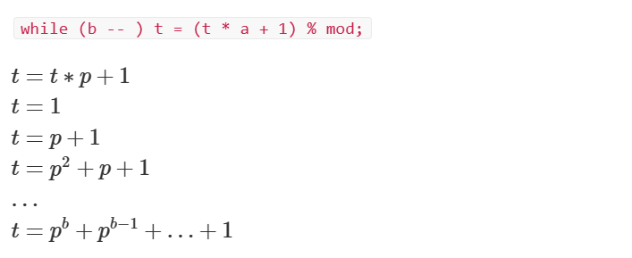

[TOC]

------

# 数论

数论要注意：

```cpp
typedef long long LL;
```


## 质数

### 质数筛

**试除法**

```cpp
if (n<2) return false;
bool prime=true;
for (int i=2;i<=sqrt(n);i++) { //i<=n/i也可
	if (n%i==0) {
		prime=false;
		break;
	}
}
// is_prime变量为true代表n为质数，为false代表是合数
```

**Eratosthenes筛（埃筛）**

```cpp
for (int i=2;i<=n;++i) { 
    if (v[i]==0) { //i为质数
        prime[++m]=i;  //prime数组存质数
        for (int j=i*i;j<=n;j+=i)
        	   v[j]=1;
    }
}
```

**欧拉筛**

```cpp
int primes[N], cnt;     // primes[]存储所有素数
bool st[N];         // st[x]存储x是否被筛掉

void get_primes(int n)
{
    for (int i = 2; i <= n; i ++ )
    {
        if (!st[i]) primes[cnt ++ ] = i;
        for (int j = 0; primes[j] <= n / i; j ++ )
        {
            st[primes[j] * i] = true;
            if (i % primes[j] == 0) break;
        }
    }
}
```

### 试除法分解质因数

一个数最小的因数就是质因数

```cpp
void divide(int x)
{
    for (int i = 2; i <= x / i; i ++ )
        if (x % i == 0)
        {
            int s = 0;
            while (x % i == 0) x /= i, s ++ ;
            cout << i << ' ' << s << endl;
        }
    if (x > 1) cout << x << ' ' << 1 << endl;
    //如果存在另一个质因子（另一个质因子必是质数）
    cout << endl;
}
//输出结果说明
第一行为其中的第一个质因子和质因子的指数
第二行为其中的第二个质因子和质因子的指数（可能没有）
```


## 约数

**什么是约数：**如果一个数a除以另一个数b的余数为0，即 a%b == 0, 则b是a的约数。

**如何求一个数x的所有约数：**

用 x 除以 1 到 x 的所有数，如果余数是0，则把除数加到答案中。

**可以优化吗？**

- 如果 a / b = c···0，则一定有 a % c = b····0。所以一个数 x 的约数肯定是成对存在的，对称轴是 根号x。
- 因此，只需要用 x 除以 1 到 根号x 之间的数，如果余数是0，则把除数以及x / 除数加到答案中。

试除法求所有约数

```cpp
vector<int> get_divisors(int x)
{
    vector<int> res;
    for (int i = 1; i <= x / i; i ++ )
        if (x % i == 0)
        {
            res.push_back(i);
            if (i != x / i) res.push_back(x / i);
        }
    sort(res.begin(), res.end());
    return res;
}

```


**约数个数和约数之和**

[871. 约数之和 - AcWing题库](https://www.acwing.com/problem/content/873/)[870. 约数个数 - AcWing题库](https://www.acwing.com/problem/content/872/)

```md
如果 N = p1^c1 * p2^c2 * ... *pk^ck
约数个数： (c1 + 1) * (c2 + 1) * ... * (ck + 1)
约数之和： (p1^0 + p1^1 + ... + p1^c1) * ... * (pk^0 + pk^1 + ... + pk^ck)

//解释：p为底数（质因数），c为指数

```

**约数个数**

给定 n 个正整数 $a_i$，请你输出这些数的乘积的约数个数，答案对 10e9+7取模。

```cpp
#include <iostream>
#include <algorithm>
#include <unordered_map>
#include <vector>
using namespace std;
typedef long long LL;
const int N = 110, mod = 1e9 + 7;
int main(){
    int n;
    cin >> n;
    unordered_map<int, int> primes;
    while (n -- ){
        int x;
        cin >> x;
        for (int i = 2; i <= x / i; i ++ )
            while (x % i == 0){
                x /= i;
                primes[i] ++ ;
            }
        if (x > 1) primes[x] ++ ;
    }
    LL res = 1;
    for (auto p : primes) res = res * (p.second + 1) % mod;
    cout << res << endl;
    return 0;
}
```

**约数之和**

给定 n 个正整数 $a_i$，请你输出这些数的乘积的约数之和，答案对 10e9+7 取模。

```cpp
#include <iostream>
#include <algorithm>
#include <unordered_map>
#include <vector>
using namespace std;
typedef long long LL;
const int N = 110, mod = 1e9 + 7;
int main(){
    int n;
    cin >> n;
    unordered_map<int, int> primes;
    while (n -- ){
        int x;
        cin >> x;
        for (int i = 2; i <= x / i; i ++ ){
            while (x % i == 0){
                x /= i;
                primes[i] ++ ;
            }
        }
        if (x > 1) primes[x] ++ ;
    }
    LL res = 1;
    for (auto p : primes){
        LL a = p.first, b = p.second;
        LL t = 1;
*       while (b -- ) t = (t * a + 1) % mod;
*       res = res * t % mod;
    }
    cout << res << endl;
    return 0;
}
```

*注释的段的解释

为了实现：

```
(p1^0 + p1^1 + ... + p1^c1) * ... * (pk^0 + pk^1 + ... + pk^ck)
```

采用：



**欧几里得算法求最大公约数 求最小公倍数**

```cpp
int gcd(int a, int b)
{
    return b ? gcd(b, a % b) : a;
}

//最小公倍数=两数乘积/最大公约数
int lcm(int a, int b){
    return a*b / gcd(a, b);
}
```


## 欧拉函数

欧拉函数的定义

> 1∼N 中与 N 互质的数的个数被称为欧拉函数，记为 ϕ(N)。

$\varphi \left( n \right) =n\left( 1-\frac{1}{p_1} \right) \left( 1-\frac{1}{p_2} \right) \cdots \left( 1-\frac{1}{p_k} \right)$

其中$n=p_{1}^{c_1}p_{2}^{c_2}\cdots p_{k}^{c_k}$

**求欧拉函数**

```cpp
int phi(int x)
{
    int res=x;
    for (int i=2;i<=x/i;i++){
        if (x%i==0){
            res=res/i*(i-1);
            while(x%i==0) x/=i;
        }
    }
    if(x>1) res=res/x*(x-1);
    return res;
}
```

说明：

- 为避免<strong>浮点数除法</strong>，编程时采用另一个形式编写代码$\varphi \left( n \right) =n\left( \frac{p_1-1}{p_1} \right) \left( \frac{p_2-1}{p_2} \right) \cdots \left( \frac{p_k-1}{p_k} \right) $
- 可用先除后乘的方式<code>res = res / n * (n-1)</code>避免结果溢出 
- 例子：$\varphi(6)=2$，因为$1$~$6$中只有$1$和$5$与$6$互质
- 可用容斥原理证明：$\varphi \left( n \right) =n-\sum_i{\frac{n}{p_i}+\sum_{i,j}{\frac{n}{p_i p_j}}-\sum_{i,j,k}{\frac{n}{p_i p_j p_k}}}+\cdots$
- 时间复杂度$O(\sqrt{n})$

**筛法求欧拉函数**

```cpp
int primes[N], cnt;     // primes[]存储所有素数,cnt表示素数数量
int euler[N];           // 存储每个数的欧拉函数
bool st[N];         // st[x]存储x是否被筛掉
void get_eulers(int n)
{
    euler[1] = 1;
    for (int i = 2; i <= n; i ++ ){
        if (!st[i]){
            primes[cnt ++ ] = i;
            euler[i] = i - 1;
        }
        for (int j = 0; primes[j] <= n / i; j ++ ){
            int t = primes[j] * i;
            st[t] = true;
            if (i % primes[j] == 0){
                euler[t] = euler[i] * primes[j];
                break;
            }
            euler[t] = euler[i] * (primes[j] - 1);
        }
    }
}
```

说明

- 核心思想：$\varphi(n)$与$n$的质指数大小无关
- 当$n$是质数时，$\varphi(n)=n-1$
- 当$n \mod p = 0$时，$\varphi(pn)=p\varphi(n)$，因为质数$p$只影响$pn$的质指数$c_p$
- 当$n \mod p \ne  0$时，$\varphi(pn)=p\varphi(n)(1-\frac{1}{p})=(p-1)\varphi(n)$，因为质数$p$影响了$pn$展开项数，多了一项$p^1$
- 借助线性筛法求欧拉函数，时间复杂度$O(n)$

## 快速幂

普通快速幂

```cpp
求 a^k mod p，时间复杂度 O(logk)。
typedef long long LL;
LL qmi(int a, int k, int p)
{
    LL res = 1, t = a;
    while (k) //对b进行二进制化,从低位到高位
    {	
        if (k&1) res = res * t % p;
        //如果k的二进制表示的第0位为1,则乘上当前的a
        t = t * (LL)t % p;
        //更新t,t依次为t^{2^0},t^{2^1},t^{2^2},....,t^{2^logk}
        k >>= 1;
        //k右移一位
    }
    return res;
}
```

说明：

- 实际上是把$k$表示成二进制$b_{\text{log}k}\cdots b_2b_1b_0$，因此$k=b_02^{2^0} + b_12^{2^1}+b_22^{2^2}+ \cdots b_{\text{log}k} 2^{2^{\text{log}k}}$
- 计算$a^k \mod p=a^{b_02^{2^0} + b_12^{2^1}+b_22^{2^2}+ \cdots b_{\text{log}k} 2^{2^{\text{log}k}}} \mod p=(a^{b_0 2^{2^0}}\mod p) \times (a^{b_1 2^{2^1}}\mod p) \times \cdots \times (a^{b_{\text{log}k} 2^{2^{\text{log}k}}}\mod p)$
- 此外迭代满足如下关系$2^{2^{i+1}} \mod p=(2^{2^{i}} \mod p)^2$
- 中间结果可能会溢出，要强制进行类型转换
- 时间复杂度$O(\text{log}k)$

矩阵快速幂

```cpp
typedef long long LL;
while(n != 0)
{
    if(n&1) mul(f0, f0, a); //这里mul函数可以看上一张 
    mul(a, a, a); // 矩阵a = 矩阵a*矩阵a
    n >>= 1;
}
void mul(int c[][4], int a[][4], int b[][4]) // 以4行4列的矩阵为例
{
	int temp[4][4];
	memset(temp, 0, sizeof temp); // 把temp数组清空
	for(int i=0;i<4;i++){
		for(int j=0;j<4;j++){
			for(int k=0;k<4;k++){
				temp[i][j]=(temp[i][j] +(LL)a[i][k]*b[k][j])%mod;
			}
		}
	}
	memcpy(c,temp,sizeof(temp)); // 把temp数组的值传给c数组
}

```

